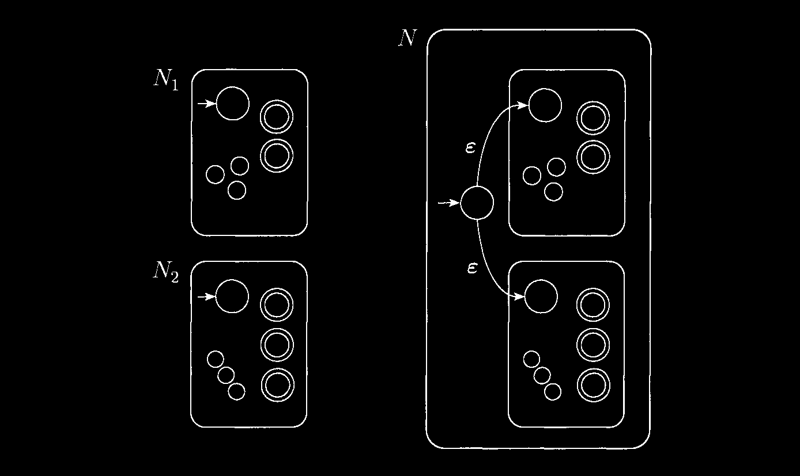
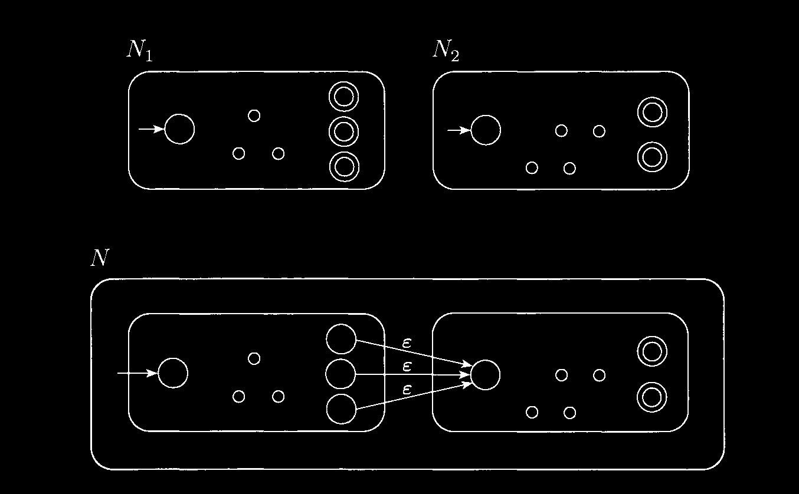
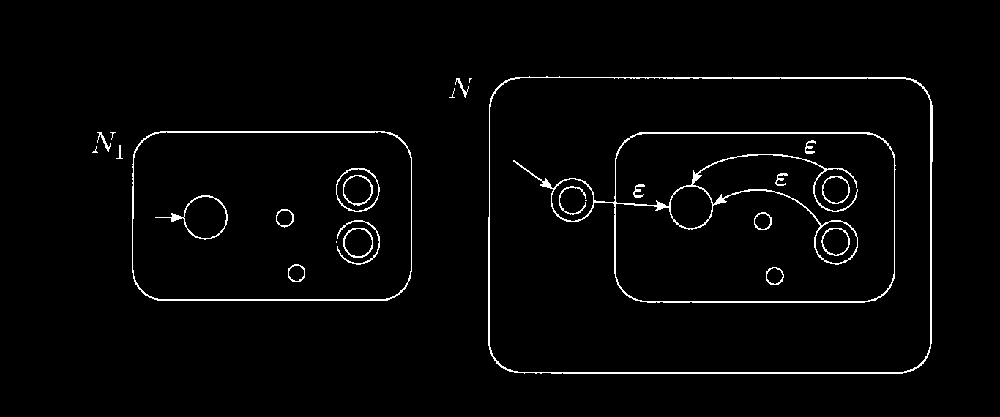
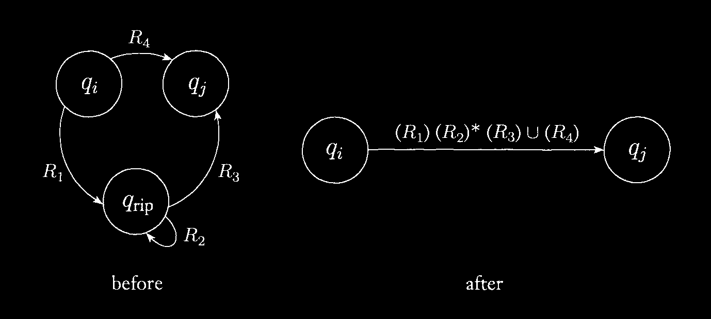

# Automata-Theory

Ayush Sharma (2019101004)

Code for following conversion : 
* Regular Expression →	  NFA [ code in q1.py ]
* NFA →	 DFA [ code in q2.py ]
* DFA →	 Regular Expression [ code in q3.py ]
* Minimizing a DFA [ code in q4.py ]


**Working Code Video link**: 

* One Drive Link - https://iiitaphyd-my.sharepoint.com/:v:/g/personal/ayush_sharma_students_iiit_ac_in/EcnheHymBjlIlqr9yJGylmUBUBRsTA8SeE0LnNC1r2qwrw?e=klRil7
* Google Drive Link - https://drive.google.com/file/d/1tAZSP8VnlR3KN4RiIgzm3U0D832QHaSH/view

# Regex →  NFA

## Code Flow

* Checking input file format. Loading if correct using `json` module.
* Called `convertToNFA()` function, which does the following:-
    
    1. If `regex` is empy string then it will return `NFA` containing 2 state with epsilon on the arc connecting them.

    2. Otherwise, I'll add character <b> `.` </b>, if possible, between the characters for recognising as concatenation operator for two NFA.

    3. Then, converted the given regex which is in `infix` format to new regex in `postfix` format using stack. Precedence order : <b> `()`</b> > <b> `*` </b>  > <b> `.` </b> > <b> `+` </b>.

    4. Next, `makeNFA(postfixRegex)` is called, that utilises method known as `Thompson contruction rules` to finally produce the `ε-NFA`. (Explained in below points)

    5. Working of `makeNFA(postfixRegex)` function: 
        * Made an empty stack.
        * Iterate through `postfixRegex`.
        * If the character is either of ε or an alphabet , push NFA for that using `unitLenRegexToNFA(alphabet)` function in the stack.
        * When our expression contains union or concatenation, we take two NFAs from the stack and combine them with the operator. Then push the new NFA in the stack. Function used : `unionNFA(NFA1, NFA2)` or `concatenationNFA(NFA1,NFA2)` repectively.
        * In the kleene star operation, only one element from the stack is popped and the operation is done on it using `starNFA(NFA1)`. The new NFA is again pushed in the stack.
        * At the end of string `postfixRegex`, we have only one NFA in the stack. That is our final `ε-NFA`.

## Thomson Construction Rules:-

This construction exploits these 2 facts:-

1. Closure property of a NFA over `Kleene star`, `Union` & `concatenation` operation.
2. `ε-transitions` contributes nothing.

**Note** : Using `ε-transitions`, this approach creates a regular expression from its elements. The `ε-transitions` serve as a "glue" or "mortar" for the NFA subcomponents. Since concatenation with the empty string leaves a regular expression unchanged (concatenation ε with is the identity operation), hence ε-transition contributes nothing.

1. The NFA’s for single character regular expressions ε, a, b : 
    ```
            a/b/ε
    →(Q0)----------->((Q1)) ; Q0 start states & Q1 is final States
    ```

2. **UNION** : The NFA for the union of N1 and N2: `N1+N2` is made up of individual NFAs with the NFA acting as "glue." Individual accepting states can be removed and replaced with the general accepting state as following:
    * Function `unionNFA(NFA1, NFA2)` return union of two provided NFAs.


3. **Concatenation** : The initial state of `N1` is the initial state of the whole NFA. The final state of `N1` becomes the initial state of `N2` . The final state of `N2` is the final state of the whole NFA.
    * Function `concatenationNFA(NFA1,NFA2)` return union of two provided NFAs.


4. **Kleene Star** : The NFA for the star of N1: `N*` is made by having `ε-transitions` in two ways:
    1. from new Global start state to all old start states and from all final states to old start states.
    2. from new Global start state to all old start states , from all final states to old start states, from all final states to new Final state and rom new Global start state to new Final state.

    * Function `starNFA(NFA)` perform second type operation on provided `NFA`.



# NFA →  DFA

A Deterministic Finite Automaton (DFA) is a good basis for a transition table since it has at most one edge from each state for a given symbol. We have to use subset construction to get rid of the ε-transitions.

Some Terms used :

**ε-closure(s)** : Set of NFA states reachable from NFA state s on ε-transitions alone. Implemented usng function `computeNfaEpsilonClosureDict()`, which creates a dictionary for each state of NFA as key with it's value to be `ε-closure()`.

**ε-closure(T)** : Set of NFA states reachable from set of states T on ε-transitions alone. Implemented using function `epsilonClosure(stateList)`, which returns a list of state i.e. `ε-closure(stateList)`.

## Code Flow

* Checking input file format. Loading if correct using `json` module.
* Called `convertNFAToDFA(NFA)` function, which does the following:-
    
    1. Copy corresponding letter from `NFA`, as language is same for DFA.
    2. Calculated power set of the NFA states. For DFA's state set.
    3. Then collected elements of power set having states as one of the NFA's final accept state. This collection is our DFA's final accept state.
    4. Created above described dicitionary named `unitStateEpsilonClosure` i.e. using `computeNfaEpsilonClosureDict()` function.[ Used concept of `DFS(Depth First Search)`. ]
    5. Calculated `ε-closure()` for start state, which wll be our final DFA state.
    6. Calculated `transition_function/transition_matrix` for final DFA by calculating `transitionedState` i.e. set of states to which there is a transition on input symbol a from some DFA state in T. Then appending to `transition_function/transition_matrix` list `[T,a,epsilonClosure(transitionedState)]`.
    7. Finaly, returned `objectFA(DFA_S,DFA_L,DFA_TM,DFA_SS,DFA_FS)` i.e. our final DFA.


```python3

def convertNFAToDFA(NFA):
    DFA_L = NFA['letters'][:]
    DFA_S = allStatesCombination(NFA['states'])
    DFA_FS = getFinalState(NFA['final_states'],DFA_S)
    
    for st in NFA['states']:
        for st1 in NFA['states']:
            visited[st1] = False
            nfaEpsilonClosureDict[st1]=[]
        unitStateEpsilonClosure[st] = computeNfaEpsilonClosureDict(st,NFA['transition_matrix'])

    DFA_SS = [ epsilonClosure([sst]) for sst in NFA['start_states'] ]
    DFA_TM = formTransitionMatrix(NFA['transition_matrix'], DFA_S, DFA_L)

    return objectFA(DFA_S,DFA_L,DFA_TM,DFA_SS,DFA_FS)

```


# DFA →  Regex


For the required cnversion there 3 thumb rules to be followed:

* If the initial state has any incoming edges, construct a new initial state that does not have any incoming edges.
* Convert all final states in the DFA to non-final states and create a new single final state where there are multiple final states.
* If the final state has any outgoing edges, build a new final state that does not have any outgoing edges.


## Code Flow


* Checking input file format. Loading if correct using `json` module.
* Called `convertDFAToRegex(myDFA)` function, which does the following:-

    1. Converted DFA → GNFA, by following steps:-
        * Add a new start state with an ε-arc to the old start state.
        * Add a new accept state with ε-arc  from old accept state.
        * If any arc has multiple labels we replace each with a single arc whose label is a union of the previous labels.
        * Finally we add arc labelled `None` between states that had no arcs between them.
        * This last step won't change the language recognise because a transition labelled with `None` can never be used.
        * This has been achieved using function ` makeGNFA(DFA)` that returns `new start state`, `new final state` and `deltaFunction`. `deltaFunction` is new transition matrix kind of thing for GNFA.
    
    2. Performed `state elimination` method until no states found in the GNFA other than `new start state` and `new final state`. Steps involved are:-
        * For each state `ripState` in DFA state, get parents & children nodes.
        * Performed the following arc-updation using function `updateArc()` where `Qrip` is `ripState` i.e. to be removed and `Qi` is one of the parent and 'Qj` is one of the children :-
        
        * Finaly returned the value at the arc from `new start state` to `new final state`. This will be our required Regular Expression.


# DFA Minimization

Used Myhill-Nerode Theorem : 

Myhill nerode theorem states that a language is regular if and only if the number of equivalence classes in R_L is finite moreover, if finite, the number of classes is the number of state in the smallest dfa for language L.

So followed the following steps to achive the minimization of DFA:-

* Construct a table with all pairs of states (Qi, Qj) that aren't necessarily related [all are unmarked at first]. Achieve this by making class named `MinimizeDFA()` & putting following variable in `__init__()` function while creating a instance for it.

    ```python3
    self.table = [ [ 0 for _ in range(len(self.s)) ] for _ in range(len(self.s))]
    ```
* Consider and mark of state pair (Qi, Qj) in the DFA where Qi ∈ F and Qj ∉  F or vice versa. [The sequence of final states is denoted by the letter F.]. Function ` __initializeTable(self)` accounts for the same.

* While not converge( basically no more partition of state space is possible) :-
    >- If the pair {δ (Qi, A), δ (Qi, A)} is labelled for any input alphabet, mark pair (Qi, Qj) if not marked.

* In the reduced DFA, combine all the unmarked pairs (Qi, Qj) into a single state.
